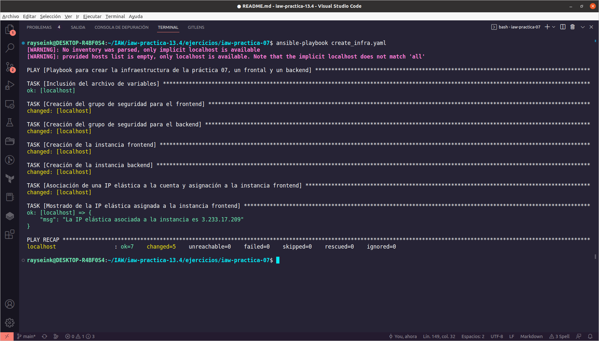
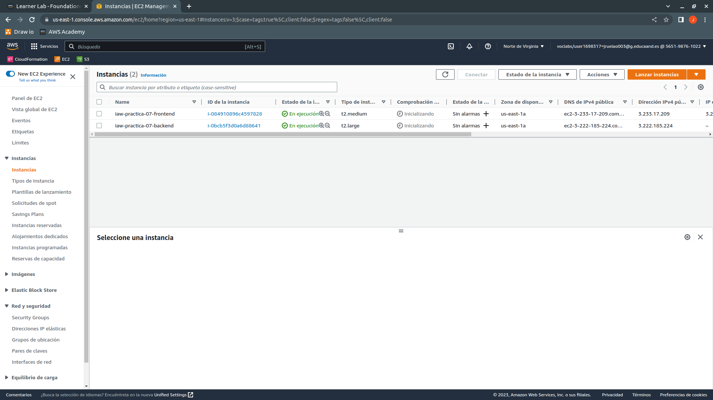
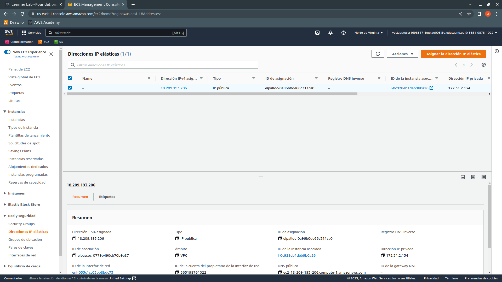

# iaw-practica-13.4

En esta práctica realizaremos **la creación de dos infraestructuras y su eliminación mediante Ansible**, la infraestructura de la práctica 07 que consistía en un frontend con IP elástica y un backend, y la infraestructura de la práctica 09 que tenía un balanceador de carga con IP elástica, dos frontend, un backend y un NFS Server.

Para esta práctica necesitamos un entorno virtual con boto3 instalado --> [entorno virtual y boto3](https://github.com/juanramonrueda/iaw-practica-13.3#instalaci%C3%B3n-y-preparaci%C3%B3n-del-entorno-virtual)

Cuando esté listo el entorno virtual y boto3, crearemos un repositorio y lo clonaremos y procederemos con la creación de la estructura del repositorio:

+ **ejercicios**
  + **iaw-practica-07**
    + **vars**
      + variables.yaml

    + create_infra.yaml

    + delete_infra.yaml

  + **iaw-practica-09**
    + **vars**
      + variables.yaml

    + create_infra.yaml

    + delete_infra.yaml

Una vez tengamos la estructura del repositorio, empezaremos con la práctica.

## iaw-practica-07

Dentro de este directorio tendremos un directorio que contendrá el archivo de variables para esta parte, un archivo para crear la infraestructura anteriormente descrita y otro archivo para eliminar la infraestructura que creemos.

### variables.yaml

Puesto que sabemos las instancias que vamos a crear, estableceremos las variables necesarias para tal fin.

```yaml
SG_Frontend:
  ec2_security_group_name: sg_frontend
  ec2_security_group_description: Grupo de seguridad para frontales sin balanceador de carga

SG_Backend:
  ec2_security_group_name: sg_backend
  ec2_security_group_description: Grupo de seguridad para backend

Ingress_permissions:
  ec2_security_group_ssh: 22
  ec2_security_group_http: 80
  ec2_security_group_https: 443
  ec2_security_group_mysql: 3306
  ec2_security_group_cidr: 0.0.0.0/0
  ec2_security_group_protocol: tcp

Instance_frontend:
  ec2_instance_name: iaw-practica-07-frontend

Instance_backend:
  ec2_instance_name: iaw-practica-07-backend

Instance_stats:
  ec2_instance_ami: ami-00874d747dde814fa
  ec2_instance_ram_4gb: t2.medium
  ec2_instance_ram_8gb: t2.large
  ec2_key_file: vockey
```

### create_infra.yaml

Empezaremos estableciendo el inicio del playbook para especificar el nombre que tendrá, los hosts a los que se aplicará este playbook, en este caso el equipo local que tiene boto3, el tipo de conexión que será local y con gather_facts denegamos la obtención de información que obtendría Ansible.

```yaml
---
- name: Playbook para crear la infraestructura de la práctica 07, un frontal y un backend
  hosts: localhost
  connection: local
  gather_facts: false
```

Continuaremos con las tareas que debemos realizar, primero, incluiremos el archivo de variables para evitar tenerlas en el playbook ya que varias de las variables las usaremos en los dos playbooks que tenemos en este directorio.

Después, crearemos el grupo de seguridad para el frontend, como no tendrá balanceador de carga, tenemos que abrir los puertos 22 (SSH), 80 (HTTP) y 443 (HTTPS), usaremos el módulo **amazon.aws.ec2_security_group** para crear el grupo de seguridad, después especificaremos el nombre que tendrá usando la variable que hemos definido en el archivo de variables y la descripción de la misma. Continuaremos con **rules para especificar el protocolo que usarán, los puertos que vamos a abrir y desde qué IPs aceptarán conexiones**, realizaremos este proceso para los tres puertos que necesitamos. De la misma manera crearemos el grupo de seguridad para el backend, cambiando las variables, abriendo únicamente los puertos 22 (SSH) y 3306 (MySQL / Aurora).

```yaml
  tasks:
    - name: Inclusión del archivo de variables
      ansible.builtin.include_vars: vars/variables.yaml

    - name: Creación del grupo de seguridad para el frontend
      amazon.aws.ec2_security_group:
        name: "{{ SG_Frontend.ec2_security_group_name }}"
        description: "{{ SG_Frontend.ec2_security_group_description }}"
        rules:
          - proto: "{{ Ingress_permissions.ec2_security_group_protocol }}"
            from_port: "{{ Ingress_permissions.ec2_security_group_ssh }}"
            to_port: "{{ Ingress_permissions.ec2_security_group_ssh }}"
            cidr_ip: "{{ Ingress_permissions.ec2_security_group_cidr }}"

          - proto: "{{ Ingress_permissions.ec2_security_group_protocol }}"
            from_port: "{{ Ingress_permissions.ec2_security_group_http }}"
            to_port: "{{ Ingress_permissions.ec2_security_group_http }}"
            cidr_ip: "{{ Ingress_permissions.ec2_security_group_cidr }}"

          - proto: "{{ Ingress_permissions.ec2_security_group_protocol }}"
            from_port: "{{ Ingress_permissions.ec2_security_group_https }}"
            to_port: "{{ Ingress_permissions.ec2_security_group_https }}"
            cidr_ip: "{{ Ingress_permissions.ec2_security_group_cidr }}"
```

Después de crear los grupos de seguridad, procederemos con la creación de las instancias, usaremos el módulo **amazon.aws.ec2_instance** y especificaremos el nombre que tendrá la instancia, el grupo de seguridad, el archivo de claves que se usará para la conexión SSH con la instancia, la cantidad de memoria RAM que tendrá, la AMI que usará para indicar el sistema operativo y que el estado sea running, también registraremos los datos de la instancia. De la misma manera crearemos la instancia backend, cambiando las variables para dicha instancia.

```yaml
    - name: Creación de la instancia frontend
      amazon.aws.ec2_instance:
        name: "{{ Instance_frontend.ec2_instance_name }}"
        security_group: "{{ SG_Frontend.ec2_security_group_name }}"
        key_name: "{{ Instance_stats.ec2_key_file }}"
        instance_type: "{{ Instance_stats.ec2_instance_ram_4gb }}"
        image_id: "{{ Instance_stats.ec2_instance_ami }}"
        state: running

      register: ec2_frontend
```

Por último, asociaremos una IP elástica a la cuenta de AWS y la asignaremos a la instancia frontend, para obtener la IP elástica y asignarla a la instancia, usaremos el módulo **community.aws.ec2_eip** y en device_id usaremos la variable que hemos registrado para la instancia frontend, junto a instances en su primera posición, [0] y por último el ID de la instancia, registrando la variable con los datos, para usar el módulo **ansible.builtin.debug** con el mensaje y la variable que hemos registrado de la IP elástica y su public_ip.

```yaml
    - name: Asociación de una IP elástica a la cuenta y asignación a la instancia frontend
      community.aws.ec2_eip:
        device_id: "{{ ec2_frontend.instances[0].instance_id }}"

      register: eip_frontend

    - name: Mostrado de la IP elástica asignada a la instancia frontend
      ansible.builtin.debug:
        msg: "La IP elástica asociada a la instancia es {{ eip_frontend.public_ip }}"
```

#### Ejecución del playbook

Puesto que es un playbook que no dispone de archivo de inventario, realizaremos la ejecución del playbook de la siguiente manera:

```bash
ansible-playbook create_infra.yaml
```

Nos saldrán dos Warning a los que no haremos caso ya que no estamos usando archivo de inventario.



Cuando el playbook haya terminado de ejecutarse, desde AWS comprobaremos que se han creado los grupos de seguridad.


También comprobaremos la creación de las instancias.



Veremos que se ha asociado una IP elástica a la cuenta.


Comprobaremos que se ha asignado la IP elástica a la instancia frontend.


### delete_infra.yaml

Con este playbook realizaremos la eliminación de la infraestructura que hemos creado con el anterior playbook, podemos reciclar una parte del playbook anterior, hasta la inclusión del archivo de variables, salvo por el nombre del playbook que lo tendremos que cambiar. Empezaremos directamente con las tareas para borrar la infraestructura.

Para borrar las instancias, tenemos que obtener el ID de cada una mediante el nombre de la instancia en una variable que debemos registrar para poder realizar la eliminación de las instancias en los siguientes pasos, usaremos el módulo **amazon.aws.ec2_instance_info** para obtener el ID junto a **filters para filtrar por el nombre de la instancia y su estado "running"**, deberemos usar register para registrar los datos de la instancia. Este paso lo realizamos sólo con el frontend ya que es la única instancia que tiene IP elástica.

```yaml
    - name: Obtención del ID de la instancia frontend mediante el nombre
      amazon.aws.ec2_instance_info:
        filters:
          "tag:Name": "{{ Instance_frontend.ec2_instance_name }}"
          "instance-state-name": "running"

      register: ec2_instance_frontend_name
```

Una vez hayamos obtenido los datos de las instancias, procederemos a liberar la IP elástica que tenía la instancia frontend con el módulo **community.aws.ec2_eip haciendo uso de la variable que hemos registrado al principio y poniendo el state en absent**, usaremos release_on_disassociation como true para la liberación de la IP elástica. Como el frontend es la única instancia que tiene IP elástica, solo tenemos que realizar este paso una vez.

```yaml
    - name: Desasociación de la IP elástica de la instancia frontend y liberación de la misma
      community.aws.ec2_eip:
        device_id: "{{ ec2_instance_frontend_name.instances[0].instance_id }}"
        release_on_disassociation: true
        state: absent
```

A continuación procederemos con la eliminación de las instancias, usaremos el nombre de la instancia y usaremos las variables que hemos incluido en el playbook al principio junto con el state a absent, realizaremos este paso con el backend también.

```yaml
    - name: Eliminación de la instancia frontend
      amazon.aws.ec2_instance:
        filters:
          "tag:Name": "{{ Instance_frontend.ec2_instance_name }}"
        state: absent
```

Por último, cuando hayamos acabado con las instancias, procederemos a borrar los grupos de seguridad. Usaremos el módulo **amazon.aws.ec2_security_group** junto con el nombre de los grupos de seguridad y el state a absent.

```yaml
    - name: Eliminación del grupo de seguridad del frontend
      amazon.aws.ec2_security_group:
        name: "{{ SG_Frontend.ec2_security_group_name }}"
        state: absent
```

#### Ejecución de delete_infra.yaml

Ejecutaremos el playbook al igual que hicimos con el playbook de create_infra.yaml.


Comprobaremos que se han eliminado las instancias desde AWS.


También comprobaremos que se han borrado los grupos de seguridad.


Por último comprobaremos que se ha liberado la IP elástica.


## iaw-practica-09

Para este directorio, crearemos y borraremos una infraestructura para un balanceador de carga con IP elástica, dos frontend, un backend y un NFS Server. También como he especificado antes, tendremos un directorio con un archivo de variables para esta parte.

### variables.yaml

Podemos usar todas las variables del archivo anterior y además agregaremos más para la creación de la infraestructura que queremos.

```yaml
SG_Balancer:
  ec2_security_group_name: sg_balancer
  ec2_security_group_description: Grupo de seguridad para balanceadores de carga

SG_Frontend:
  ec2_security_group_name: sg_frontend
  ec2_security_group_description: Grupo de seguridad para frontales con balanceador de carga

SG_Backend:
  ec2_security_group_name: sg_backend
  ec2_security_group_description: Grupo de seguridad para backend

SG_Nfs:
  ec2_security_group_name: sg_nfs
  ec2_security_group_description: Grupo de seguridad para NFS Server

Ingress_permissions:
  ec2_security_group_ssh: 22
  ec2_security_group_http: 80
  ec2_security_group_https: 443
  ec2_security_group_mysql: 3306
  ecs_security_group_nfs: 2049
  ec2_security_group_cidr: 0.0.0.0/0
  ec2_security_group_protocol: tcp

Instance_balancer:
  ec2_instance_name: iaw-practica-09-balancer

Instance_frontend_01:
  ec2_instance_name: iaw-practica-09-frontend-01

Instance_frontend_02:
  ec2_instance_name: iaw-practica-09-frontend-02

Instance_backend:
  ec2_instance_name: iaw-practica-09-backend

Instance_nfs:
  ec2_instance_name: iaw-practica-09-nfs

Instance_stats:
  ec2_instance_ami: ami-00874d747dde814fa
  ec2_instance_ram_4gb: t2.medium
  ec2_instance_ram_8gb: t2.large
  ec2_key_file: vockey
```

### create_infra.yaml

Como este playbook es similar al de creación del directorio anterior, algunas partes de pueden usar para este.

Primero procederemos con la creación de los grupos de seguridad en este caso tenemos cuatro grupos de seguridad, uno para el balanceador de carga, otro para los frontend, otro para el backend y otro para el NFS Server, por lo que seguiremos los mismos pasos para todos cambiando las variables, salvo para el balanceador de carga, que tiene tres reglas de entrada.

```yaml
   - name: Creación del grupo de seguridad para el balanceador de carga
      amazon.aws.ec2_security_group:
        name: "{{ SG_Balancer.ec2_security_group_name }}"
        description: "{{ SG_Balancer.ec2_security_group_description }}"
        rules:
          - proto: "{{ Ingress_permissions.ec2_security_group_protocol }}"
            from_port: "{{ Ingress_permissions.ec2_security_group_ssh }}"
            to_port: "{{ Ingress_permissions.ec2_security_group_ssh }}"
            cidr_ip: "{{ Ingress_permissions.ec2_security_group_cidr }}"

          - proto: "{{ Ingress_permissions.ec2_security_group_protocol }}"
            from_port: "{{ Ingress_permissions.ec2_security_group_http }}"
            to_port: "{{ Ingress_permissions.ec2_security_group_http }}"
            cidr_ip: "{{ Ingress_permissions.ec2_security_group_cidr }}"

          - proto: "{{ Ingress_permissions.ec2_security_group_protocol }}"
            from_port: "{{ Ingress_permissions.ec2_security_group_https }}"
            to_port: "{{ Ingress_permissions.ec2_security_group_https }}"
            cidr_ip: "{{ Ingress_permissions.ec2_security_group_cidr }}"
```

Después de los grupos de seguridad, crearemos las cinco instancias con el state a "running" y registrando sus datos.

```yaml
    - name: Creación de la instancia balancer
      amazon.aws.ec2_instance:
        name: "{{ Instance_balancer.ec2_instance_name }}"
        security_group: "{{ SG_Balancer.ec2_security_group_name }}"
        key_name: "{{ Instance_stats.ec2_key_file }}"
        instance_type: "{{ Instance_stats.ec2_instance_ram_4gb }}"
        image_id: "{{ Instance_stats.ec2_instance_ami }}"
        state: running

      register: ec2_balancer
```

A continuación, asociaremos una IP elástica a la cuenta y posteriormente su asignación a la instancia que hará de balanceador de carga usando su variable registrada. Por último, mostraremos la IP elástica que tiene asignada la instancia.

```yaml
    - name: Asociación de una IP elástica a la cuenta y asignación a la instancia frontend
      community.aws.ec2_eip:
        device_id: "{{ ec2_balancer.instances[0].instance_id }}"

      register: eip_balancer

    - name: Mostrado de la IP elástica asignada a la instancia frontend
      ansible.builtin.debug:
        msg: "La IP elástica asociada a la instancia es {{ eip_balancer.public_ip }}"
```

#### Ejecución de create_infra.yaml

Ejecutaremos el playbook y comprobaremos que no tiene errores.


Después, en AWS comprobaremos la creación de los grupos de seguridad.


A continuación, comprobaremos la creación de las instancias.


Comprobaremos que la IP que nos ha mostrado al realizar la ejecución del playbook es la misma que la IP que tenemos asociada.



Por último, comprobaremos la asignación de la IP a la instancia que hace de balanceador de carga.


### delete_infra.yaml

Con este playbook realizaremos la eliminación de la infraestructura creada en este apartado, parte del código del playbook de la primera parte lo podemos reciclar para este.

Primero procederemos con la liberación de la IP elástica, para ello, usaremos el módulo **amazon.aws.ec2_instance_info** y necesitamos el ID de la instancia que hace de balanceador de carga y registraremos los datos de la instancia en una variable. Después, mediante el los datos de la instancia, obtendremos el ID y procederemos a liberar la IP elástica de la instancia y de la cuenta de AWS usando el módulo **community.aws.ec2_eip**. Por último, procederemos a eliminar la instancia usando el módulo **amazon.aws.ec2_instance junto al state absent**. El proceso de eliminación de las instancias lo realizaremos con el resto de instancias.

```yaml
    - name: Obtención del ID de la instancia balancer mediante el nombre
      amazon.aws.ec2_instance_info:
        filters:
          "tag:Name": "{{ Instance_balancer.ec2_instance_name }}"
          "instance-state-name": "running"

      register: ec2_instance_balancer_name

    - name: Desasociación de la IP elástica de la instancia balancer y liberación de la misma
      community.aws.ec2_eip:
        device_id: "{{ ec2_instance_balancer_name.instances[0].instance_id }}"
        release_on_disassociation: true
        state: absent

    - name: Eliminación de la instancia balancer
      amazon.aws.ec2_instance:
        filters:
          "tag:Name": "{{ Instance_balancer.ec2_instance_name }}"
        state: absent
```

Por último, procederemos con el borrado de los grupos de seguridad mediante el módulo **amazon.aws.ec2_security_group y usando el nombre del grupo de seguridad**. Este proceso lo realizaremos para los demás grupos de seguridad restantes.

```yaml
    - name: Eliminación del grupo de seguridad del load balancer
      amazon.aws.ec2_security_group:
        name: "{{ SG_Balancer.ec2_security_group_name }}"
        state: absent
```

#### Ejecución de delete_infra.yaml

Cuando el playbook esté listo, procederemos a ejecutarlo.


Comprobaremos que se han eliminado las instancias.


Después, comprobaremos el borrado de los grupos de seguridad.


Por último, comprobaremos que la IP elástica se ha liberado.


